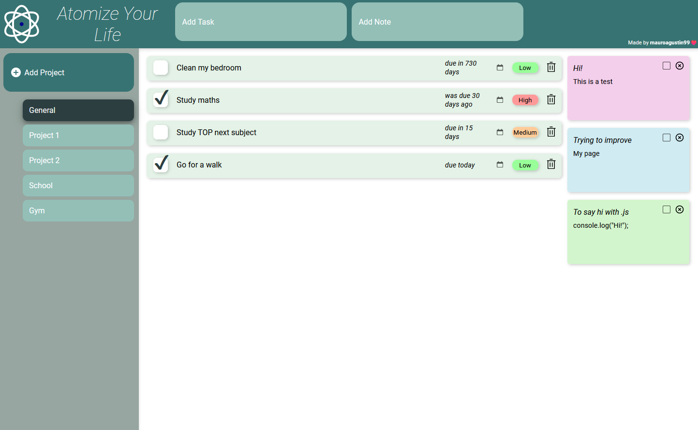
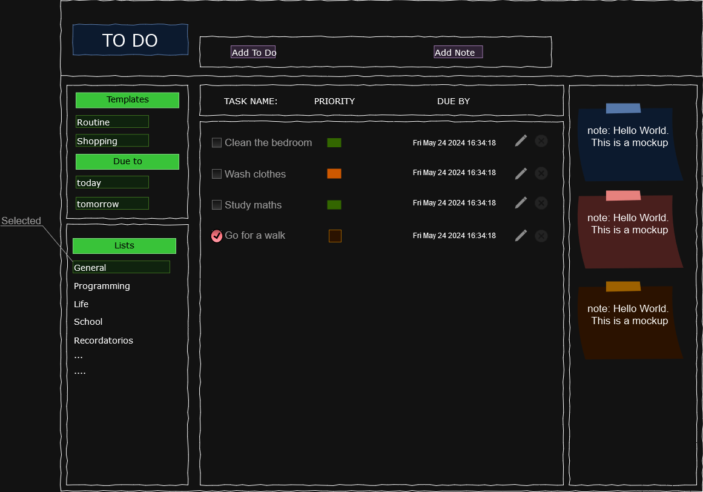

# to-do-list

The "Hello World" of web development

[Live Preview 👈](https://mauroagustin99.github.io/to-do-list/)

## Introduction

Welcome to my To-Do List project! This is a simple yet powerful application that allows you to manage tasks for different projects. It's a great way to get organized and keep track of your tasks.

## Features

- **Create Tasks for Each Project:** Easily add new tasks for any project you're working on.
- **Save Tasks:** Each task includes text, a due date (using date-fns), and a priority level. All tasks are saved in the local storage so you won't lose them.
- **Notes:** Add notes that you can change the color of. These are also saved in local storage.
- **Stylish Design:** The app is styled using CSS to make it look clean and modern.

## Tech Stack

- **Webpack:** Bundles the JavaScript files and other assets.
- **JavaScript:** The core functionality of the app.
- **CSS:** For styling the app.
- **date-fns:** A modern JavaScript date utility library for parsing, formatting, and manipulating dates.
- **Local Storage:** Saves tasks and notes so your data persists between sessions.

## How It Looks Now

## Mockup of the project

